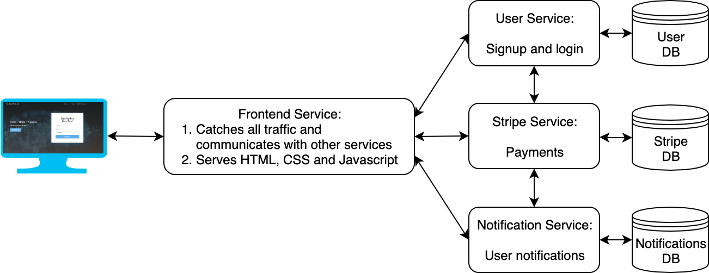

# Flask Stripe MySQL Bootstrapped
This template is ready for scaling and is easy to deploy.


# Technologies and features

- [x] Python & Flask & MySQL Database
- [x] Stripe Subscriptions (Create, Cancel, Reactivate, Update supported)
- [x] Bootstrapped theme [Creative](https://startbootstrap.com/themes/creative/) and [SB Admin 2](https://startbootstrap.com/themes/sb-admin-2/)
- [x] User sign up and login (Facebook & Google integration in progress)
- [x] 3 Pricing Tiers included (Starter, Growth, Scale)
- [x] Base templates: Index, Dashboard and Pages
- [x] Secure app: Protection against XSS, X-XSS, CSRF, clickjacking (iframe) attacks
- [x] Trial Period (defaults to 24 hours)
- [x] Notifications for users (upselling, credit card expiring soon, etc.)
- [ ] Feedback button: Easily gather feedback from users
- [ ] Email validation
- [ ] Multiprocessing with Gunicorn, for SQLAlchemy and MySQL
- [ ] Docker: Fully split into microservices with Docker (Gunicorn -> Flask)
- [ ] Admin account: View feedback, logs, errors, etc.

## Future Work

The frontend was purposely *NOT* made into microservices, e.g. serving the front page and dashboard from two different services. If this app needs a heavy and larger frontend, I would advice to serve different pieces of frontend from different services (for *true* scaling). This should not be an issue at all, unless you add way more static files for serving - but even then, adding more nodes/pods into a Kubernetes service/deployment is probably more feasible. Martin Fowler has a [great article](https://martinfowler.com/articles/micro-frontends.html) on his website by Cam Jackson on exactly this issue.

Another piece of advice would be to use separate databases for each service, instead of separate tables as of right now.

This is a simple overview of the system. Go to the app folder and see the technical README for a more detailed overview.



## Todo

- Make frontend service only access database through the other services
- Move on to upgrading/downgrading monthly and yearly plans
- Add billing information (invoice date, description, amount, was it paid)
- Variable builder

# How To Run The Application (After Installation, See Below)

1. Run the docker containers, for an example:

```
cd ~/app
docker build -t test:0.1 -f services/FrontendService/Dockerfile .
docker run -it -d -p 5000:5000 9a6aef873074
```

# Installation

1. Install Python (3.7 was used for this project)
2. Install the package requirements `pip install -r requirements.txt`
3. Download and install MySQL server and run it
- Windows: See Windows section below
- Mac/Linux: See Mac and Linux section below
4. Configure your connector in `app/setup_app/config.py`. I configured MySQL to run on port 5001, but the default port is 3306, which you can easily switch the port to in the code.
5. Install Docker

## Windows

Download [MySQL server](https://dev.mysql.com/downloads/mysql/) and start it.

**\*\*IMPORTANT**: Make sure to check **"Configure MySQL Server as a Windows Service"** and **"Start the MySQL server at System Startup"**. 

Check the service is configured by pressing windows key or WINDOWS KEY+R and typing `services.msc` and find MySQL (e.g. MySQL80). It should be running, also after you have restarted your computer. Always check back here if something is not running.

### Register Environment Variables

A tip that makes your life easier:

1. Press the windows key and search for 'edit environment variables'
2. In the upper section, double click path. Then click new. Then find your installation folder for mysql, e.g. mine was under `C:\Program Files\MySQL\MySQL Server 8.0\bin`. Add it as your path and click ok.
3. Now you can use mysql, mysqld and mysqladmin commands which will be helpful for debugging.

### Login to the database from Windows

Open MySQL vXX Command Line Prompt (e.g. MySQL 8.0 Command Line Prompt) and enter your password, e.g. `rootpw` is used in this repo.

## Mac and Linux

Use Homebrew to install mysql. Installing homebrew is the first step:

1. Install homebrew: `/usr/bin/ruby -e "$(curl -fsSL https://raw.githubusercontent.com/Homebrew/install/master/install)"`
2. Install mysql `brew install mysql`
3. Check it's installed `mysql -V`
4. Locate your mysql config file. Mine was under `/usr/local/etc/my.cnf`, but check `/etc/my.cnf` or `/etc/mysql/my.cnf` or `~/.my.cnf` if you can't find it.
5. (you can skip this, but I prefer it) Change your default port from 3306 by opening `my.cnf`. Add a new line with `port=5001`
6. Start mysql `brew services start mysql` (starts every time you boot computer)
7. Configure your password `mysqladmin -u root password 'yourpassword'`. This password should be strong if used in production.

You can always restart or stop the service, e.g. if the service is running and you edit your config file, you need to restart the service for it to pick it up:

- `brew services restart mysql`
- `brew services stop mysql`

### Login to MySQL database from Mac and Linux

Type in `mysqladmin -u root -p` and press enter. It will ask for your password, then you are in.