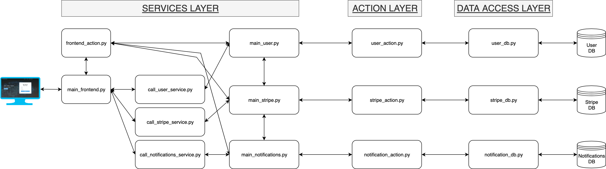

# Flask Stripe MySQL Bootstrapped
Here is an overview of the folders. Everything in this template is contained in the current folder /app.

- **\<microservice\>/setup_app**: contains the `__init__.py` file that sets up necessary databases and tables, Flask app and folders paths. You can also find the `config.py` file in this folder, where you can configure your various secrets and other stuff, which will propagate throughout the app for easy use. Note that you should probably make separate config files for development, staging and production.
- **FrontendMicroservice/templates**: contains only html files, which are used to display the website. This templates folder has some server-generated content with Jinja2, and it loads files from the static folder. Some files from static/partials are used a lot in the templates folder.
- **FrontendMicroservice/static**: The static folder contains various libraries, images and code. As the name suggests, this is (mostly) static files, and our app only serves what it needs to serve. The static folder has a lot of files which will not be served. In this folder, you can find the styling of the HTML under static/css. Remember to always minimize the css whenever you are adding to the css files - only the `.min.css` are used (except for pricing.css, for now).